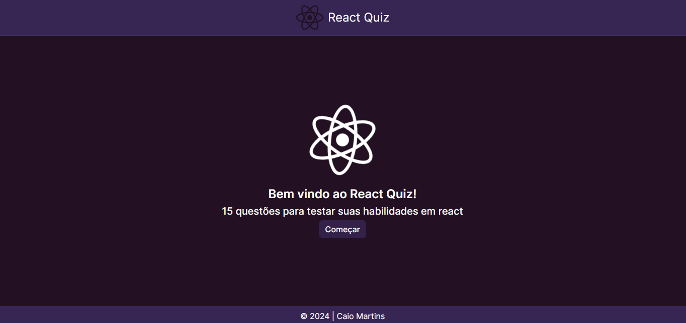
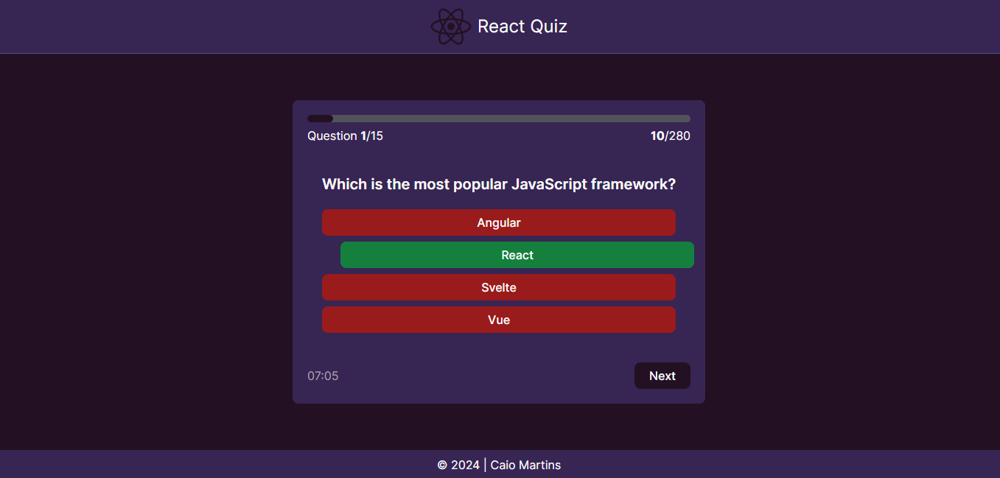
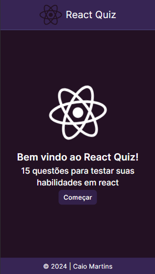
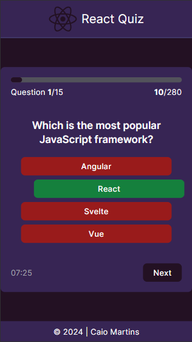
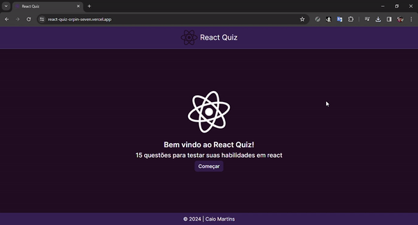

## 🖥 Desktop

## 📱 Mobile

## 📌 Sobre

**React Quiz** é um quiz que contem perguntas sobre react.

## 🚀 Tecnologias utilizadas

O projeto foi desenvolvido utilizando as seguintes tecnologias:

- [Next](https://nextjs.org/)
- [Typescript](https://www.typescriptlang.org/)
- [Tailwindcss](https://tailwindcss.com/)
- [Framer Motion](https://www.framer.com/motion/)

## 💻 O projeto pode ser vizualizado acessando o seguinte link

<https://react-quiz-orpin-seven.vercel.app/>

## 👀  Exemplo

